# PipeOne — Multi-Source Developer Intelligence Platform

<p align="center">
  <b>A multi-source Developer Intelligence Platform built with Python, PostgreSQL, dbt, Apache Airflow, and Streamlit.</b><br/>
  Ingests live developer activity events from GitHub APIs and community discussion signals from Hacker News, transforming them through a dbt Medallion Architecture orchestrated by Apache Airflow inside PostgreSQL.
</p>

<p align="center">
  <a href="https://www.python.org/downloads/"></a>
  <a href="https://www.getdbt.com/"></a>
  <a href="https://www.postgresql.org/"></a>
  <a href="https://airflow.apache.org/"></a>
  <a href="https://streamlit.io/"></a>
  <a href="https://www.docker.com/"></a>
  
  <a href="LICENSE"></a>
</p>

---

## 💡 Overview

**PipeOne** is a modern data platform built to capture, normalize, and visualize developer signal metrics across version control and community discussion ecosystems. 

### Why Developer Intelligence?
In open-source software, developer traction is a leading indicator of project adoption, reliability, and health. However, version control metrics (commits, pull requests) only tell half the story. The other half resides in community spaces (discussions, news sharing, upvotes). 

By combining **GitHub** repository activity with **Hacker News** mentions and engagement, PipeOne enables cross-source intelligence, providing insights into:
* 📈 **Velocity:** Are developer contributions and commits accelerating?
* 💬 **Traction:** How is that code correlating with community discussions and developer buzz?
* 👥 **Audience:** Who is driving the codebase (human users vs. automated bots)?

---

## ✨ Key Features

* 📥 **Multi-Source Ingestion:** Resilient API clients for GitHub REST API (Push & PR events) and Hacker News Firebase API (top stories & item details) with exponential backoff retries.
* 💾 **Relational JSONB Storage:** Retains complete API payloads in PostgreSQL binary JSON fields to avoid upstream data-loss.
* 🏗️ **dbt Medallion Architecture:** Modular transformations modeling raw payloads into Bronze (staging), Silver (intermediate parsing & mentions extraction), and Gold (serving dimensions & facts).
* 🔗 **Cross-Source Referencing:** Regex pattern-matching attributing Hacker News stories to tracked repositories.
* 🧪 **Data Quality Gates:** 128 automated schema, constraints, and business-logic assertions executed via dbt test.
* 🌀 **Airflow Orchestration:** Linear DAG flow managing pipeline sequence and strict task failure propagation.
* 📊 **Streamlit Console:** A 7-page analytical dashboard offering executive KPIs, trends, profiles, and pipeline transparency.

---

## 🔄 Visual Architecture & Project Flowchart

This section outlines the platform's multi-tier data pipeline structure, designed for high throughput, data cleanliness, and clear analytical observability.

### 🔄 System Architecture Flowchart
 **Data Ingestion Layer**: 
   - [GitHub REST API] and [Hacker News Firebase API] act as concurrent external ingestion endpoints.
 **Central Data Storage (Raw Warehouse)**:
   - A Python ingestion script runs concurrently to pull data from both channels, populating the central PostgreSQL Raw Warehouse layer into `github_events_raw` and `hn_stories_raw` tables.
 **dbt Medallion Architecture Transformation**:
   - Data streams through a decoupled 3-tier quality matrix:
     * Bronze Tier: Staged data parsing, clean field mapping, and explicit type-casting.
     * Silver Tier: Data cleaning, deduplication, and parsing repository mention tokens using SQL lateral cross-joins.
     * Gold Tier: Analytics-ready Star Schema facts and conformed dimensions serving pre-computed platform metrics.
 **Pipeline Orchestration & Monitoring**:
   - An [Apache Airflow DAG Engine] acts as the core workflow controller running adjacent to the pipeline, validating the systematic loop via automated health gates: Ingest ➔ dbt Build ➔ dbt Test.
 **Business Intelligence Presentation**:
   - A clean [Streamlit Analytical Presentation Dashboard] reads exclusively from the validated Gold tier layer, providing instant executive insights via separate presentation modules: Overview Analytics, Community Traction Insights, and Pipeline Health Telemetry.

```mermaid
graph LR

%% ===== Styles =====
classDef source fill:#E0F2FE,stroke:#0284C7,stroke-width:2px,color:#0369A1;
classDef process fill:#F8FAFC,stroke:#475569,stroke-width:2px,color:#334155;
classDef db fill:#FEF3C7,stroke:#D97706,stroke-width:2px,color:#B45309;
classDef dbt fill:#DCFCE7,stroke:#16A34A,stroke-width:2px,color:#15803D;
classDef dashboard fill:#FCE7F3,stroke:#DB2777,stroke-width:2px,color:#BE185D;
classDef orchestration fill:#F3E8FF,stroke:#7C3AED,stroke-width:2px,color:#6D28D9;
classDef insight fill:#E0FCEB,stroke:#059669,stroke-width:2px,color:#047857;

%% ===== Sources =====
subgraph SOURCES["External Data Sources"]
GH["GitHub REST API"]
HN["Hacker News API"]
end

%% ===== Ingestion =====
subgraph INGEST["Python Ingestion Layer"]
PY["github_client.py<br/>hn_client.py"]
end

%% ===== Storage =====
subgraph STORAGE["PostgreSQL Warehouse"]
DB[("Raw JSONB Storage")]
end

%% ===== Transformation =====
subgraph DBT["dbt Medallion Architecture"]
BRONZE["Bronze<br/>Clean & Stage"]

SILVER["Silver<br/>Transform"]

GOLD["Gold<br/>Analytics"]
end

%% ===== Quality =====
QUALITY["dbt Build<br/>dbt Test<br/>✅ 128 Tests Passed"]

%% ===== Dashboard =====
subgraph DASH["Streamlit Dashboard"]

VIEW["Repository Analytics<br/>Community Traction<br/>Contributor Insights<br/>Pipeline Health"]

end

%% ===== Output =====
OUTPUT["Developer Intelligence"]

%% ===== Orchestration =====
AIRFLOW{{"Apache Airflow"}}

%% ===== Flow =====
GH --> PY
HN --> PY

PY --> DB

DB --> BRONZE
BRONZE --> SILVER
SILVER --> GOLD

GOLD --> QUALITY

QUALITY --> VIEW

VIEW --> OUTPUT

%% ===== Orchestration =====
AIRFLOW -.-> PY
AIRFLOW -.-> QUALITY

%% ===== Classes =====
class GH,HN source
class PY process
class DB db
class BRONZE,SILVER,GOLD dbt
class VIEW dashboard
class AIRFLOW orchestration
class OUTPUT insight
```



---

## 🏗️ Medallion Architecture Models

To clean, model, and prepare the raw JSON data, we use a dbt Medallion Architecture. This transforms raw API responses into clean, structured, and analytics-ready tables:

| Layer | Model | Type | Purpose / Rationale |
| :--- | :--- | :--- | :--- |
| **Bronze** | `stg_github_events` | View | Validates raw GitHub payload entries, handles basic casting, and filters null elements. |
| **Bronze** | `stg_hn_stories` | View | Converts Unix timestamps from Hacker News raw entries to standard SQL timestamps. |
| **Silver** | `int_push_events` | View | Extracts, parses, and normalizes commit counts from raw JSONB `PushEvent` structures. |
| **Silver** | `int_pull_requests` | View | Flattens PR action metadata (opened, closed, merged statuses) from PR payloads. |
| **Silver** | `int_hn_stories` | View | Filters items to valid stories only, parses root web domains. |
| **Silver** | `int_hn_repo_mentions` | View | Attributes repository mentions in titles using regex match patterns. |
| **Gold** | `dim_repository` | Table | Repository dimensional master; aggregates total activity statistics. |
| **Gold** | `dim_contributor` | Table | Unified developer dimension. Classifies logins into `User` vs. `Bot`. |
| **Gold** | `dim_hn_story` | Table | Normalized dimension for Hacker News stories. |
| **Gold** | `fct_github_daily_activity`| Table | Rollup fact recording total events, pushes, and commits per repository daily. |
| **Gold** | `fct_contributor_daily_activity`| Table | Tracks contributor commits/PR counts per repository daily. |
| **Gold** | `fct_hn_daily_activity` | Table | Aggregates daily story count and upvotes. |
| **Gold** | `fct_hn_repo_mentions` | Table | Daily grain link table tracking project mentions in community posts. |

---

## 🖥️ Streamlit Dashboard Showcase

The interactive Streamlit dashboard serves different insights across its pages:

* **🏠 Home:** Landing page and platform overview showcasing tracked repository metrics.
* **📊 Overview:** Executive summary showing commits, pushes, and PR trends over time.
* **📈 Repository Analytics:** Deep dive into star count, push trends, and PR merge velocity per repository.
* **👥 Contributor Analytics:** Developer contribution rankings and user vs. bot distribution.
* **💬 Community Traction:** Hacker News story count, average score, and repository mention volume.
* **🩺 Pipeline Health:** Quality and freshness auditor displaying table freshness and row count.
* **ℹ️ About:** Technical details, architecture layouts, and developer info.

---

## 🛠️ Technology Stack

| Technology | Purpose | Version |
| :--- | :--- | :--- |
| **Python** | Core data extraction and scripting | `3.11+` |
| **dbt Core** | Database transformation and schema test compiler | `1.7.4` |
| **PostgreSQL** | Relational data warehousing | `15` |
| **Apache Airflow** | DAG workflow scheduler and monitor | `2.9.3` |
| **Streamlit** | Frontend analytical console UI | `1.36.0` |
| **Docker Compose** | Isolated local environment containerization | `compose-v2` |
| **Plotly / Pandas** | Data parsing, aggregations, and charts | Standard |

---
## Project Structure
```
pipeone/
├── .env.example                # Template for database & API credentials
├── docker-compose.yml          # Container configuration (Postgres & Airflow)
├── requirements.txt            # Python dependencies (requests, dbt, streamlit)
├── verify_pipeline.py          # Data verification script (Week 1 stats)
│
├── airflow/                    # Airflow Orchestration
│   ├── Dockerfile              # Custom image baking pip dependencies
│   ├── dags/
│   │   └── pipeone_pipeline.py # Orchestrator DAG (Ingestion -> dbt build -> dbt test)
│   └── dbt_profiles/           # dbt profiles.yml used in Airflow container
│
├── dbt_project/                # dbt Transformations Layer
│   ├── dbt_project.yml         # dbt project configurations
│   ├── profiles.yml.example    # Profile config template for Postgres
│   ├── models/
│   │   ├── staging/            # Bronze staging views (stg_*)
│   │   ├── silver/             # Silver intermediate transformations (int_*)
│   │   └── gold/               # Gold serving dimension & fact tables (dim_*, fct_*)
│   └── tests/                  # Custom business validation tests (*.sql)
│
└── src/                        # Python Application Source
    ├── dashboard/              # Streamlit Application
    │   ├── app.py              # Main dashboard entrypoint
    │   ├── config/settings.py  # Dashboard configs & DB connection helper
    │   └── pages/              # Individual analytics pages (01_* to 06_*)
    ├── database/
    │   ├── init_db.py          # GitHub raw table setup schema
    │   └── init_hn_db.py       # Hacker News raw table setup schema
    └── ingestion/
        ├── github_client.py    # GitHub events ingestion client
        └── hn_client.py        # Hacker News story ingestion client
```
## 📦 Installation & Setup

Set up the project locally by following these steps:

<details>
<summary>📋 Prerequisites</summary>

- [Docker Desktop](https://www.docker.com/products/docker-desktop/) installed and running.
- [Python 3.11](https://www.python.org/downloads/) installed.
- A GitHub Personal Access Token (classic) with read-only access (no scopes needed for public APIs).

</details>

### 1. Clone & Set Up Environment
```bash
git clone https://github.com/Diw696/pipeone-github-analytics.git
cd pipeone-github-analytics

# Create and activate virtual environment
python -m venv .venv
# On Windows (cmd/PowerShell):
.venv\Scripts\activate

# Install dependencies
pip install -r requirements.txt
```

### 2. Configure Credentials
Copy `.env.example` to `.env` and fill in the required environment variables:
```bash
cp .env.example .env
```
Open `.env` and add:
- `GITHUB_TOKEN`: Your GitHub personal access token.
- `POSTGRES_PASSWORD`: Choose a password for your warehouse.
- `AIRFLOW_POSTGRES_PASSWORD`: Choose a password for the Airflow internal database.
- Generate `AIRFLOW_FERNET_KEY` and `AIRFLOW_SECRET_KEY` (use command instructions in `.env.example`).

### 3. Spin Up Infrastructure
Start the data warehouse and Apache Airflow containers:
```bash
docker compose up -d
```
Verify that all containers are healthy:
```bash
docker compose ps
```

### 4. Initialize Database Schemas
Run the initialization scripts to create raw PostgreSQL tables and indexes:
```bash
python src/database/init_db.py
python src/database/init_hn_db.py
```

### 5. Run Ingestion Clients
Extract initial datasets from the source APIs and load them into PostgreSQL:
```bash
python src/ingestion/github_client.py
python src/ingestion/hn_client.py
```

### 6. Run dbt Transformations & Tests
Set up your local dbt profile:
```bash
# Set up default configuration
mkdir -p ~/.dbt
# Copy profiles.yml.example to ~/.dbt/profiles.yml and update credentials
```
Execute the transformation models and run the assertion test suite:
```bash
cd dbt_project
dbt deps
dbt build --target dev
```

### 7. Launch Streamlit Analytics Console
Run the dashboard application:
```bash
# Return to project root directory
cd ..
streamlit run src/dashboard/app.py
```
Open your browser at `http://localhost:8501`.

---

## ⚡ Quick Start (Airflow Orchestration)

To run the pipeline as a fully scheduled and monitored workflow:

1. Open `http://localhost:8080` in your web browser.
2. Sign in with the admin credentials set in your `.env` (Default: `admin` / `your_airflow_admin_password`).
3. Find the `pipeone_pipeline` DAG in the list.
4. Toggle the DAG status to **Active** (On).
5. Click **Trigger DAG** on the top right to start the execution block (`extract_github_events` -> `extract_hn_stories` -> `dbt_build` -> `dbt_test`).

---

## 🛡️ Data Quality & Test Gates

We enforce **128 automated validation tests** on every build run to ensure warehouse integrity:

1. **Schema Assertions:** Checks column nullability, unique primary keys, and conformed relationships (foreign keys) across all fact tables.
2. **Accepted Values:** Limits field values on dimension attributes (e.g. ensuring `repo_name` is strictly react, vscode, or next.js).
3. **Custom Business Rules:** Realized via SQL files in `dbt_project/tests/`:
   - [no_future_timestamps.sql](dbt_project/tests/no_future_timestamps.sql): Blocks incoming data rows indicating event creation dates ahead of current server timestamps.
   - [no_negative_commit_count.sql](dbt_project/tests/no_negative_commit_count.sql): Ensures commit counts in pushes are non-negative.
   - [push_model_integrity.sql](dbt_project/tests/push_model_integrity.sql): Validates child push event data correctly maps to parent github events.

---

## 🎯 Tracked Repository Coverage

PipeOne monitors the following open-source codebases:

1. **`facebook/react` (JavaScript):** High-activity library representing frontend UI ecosystem signals.
2. **`microsoft/vscode` (TypeScript):** Highly complex development tool codebase showing developer tool signals.
3. **`vercel/next.js` (JavaScript):** Fast-moving framework showing framework-level developer activity.

---

## 🚀 Engineering Challenges Solved

* 📦 **Preserving Raw Payloads:** Storing unpredictable, nested API structures inside `JSONB` fields prevents data-loss from schema changes while retaining low-latency indexing support.
* 🔄 **Handling Mutable Community Data:** GitHub event records are immutable log entries (`ON CONFLICT DO NOTHING`), whereas Hacker News stories are active discussions where score, upvote, and comment totals change continuously. The HN client handles this via idempotent upserting (`ON CONFLICT (story_id) DO UPDATE`).
* 🔍 **Entity Mentions Extraction:** Sourcing and connecting mention metrics by querying repository identifiers inside story titles using SQL Regex patterns at the dbt compiling layer (`int_hn_repo_mentions`).
* 🚦 **Strict Orchestration Ordering:** Enforcing linear execution flow via Airflow task constraints, ensuring data staging and ingestion do not proceed to modeling if an upstream extraction fails.

---

## 🗺️ Future Roadmap

- **CI/CD pipeline:** Integrate automated tests and validation on code pull requests.
- **Incremental dbt models:** Optimize processing efficiency as raw database table sizes scale.
- **Additional developer communities:** Add source connectors for Stack Overflow, Reddit, and Dev.to.
- **Observability & monitoring:** Implement dashboard telemetry, log aggregation, and pipeline alerting.

---

## 👨‍💻 Developer

**Diwakar Kaushik**  
*CSE — Data Engineering & AI · Lovely Professional University*  
- **Email:** devkaushik6906@gmail.com  
- **GitHub:** [@Diw696](https://github.com/Diw696)  

---

## 📄 License

This project is licensed under the MIT License - see the [LICENSE](LICENSE) file for details.

