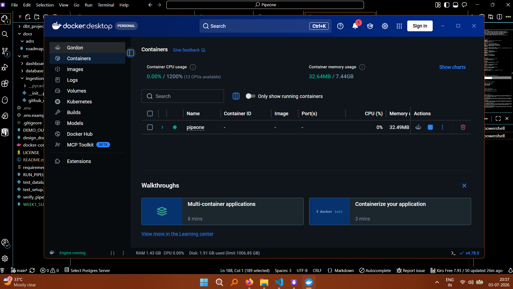
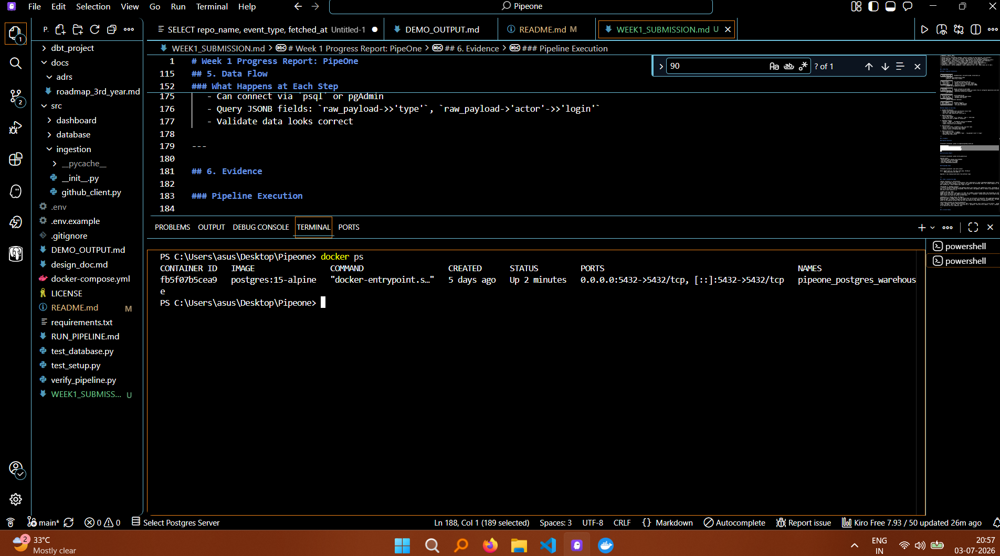
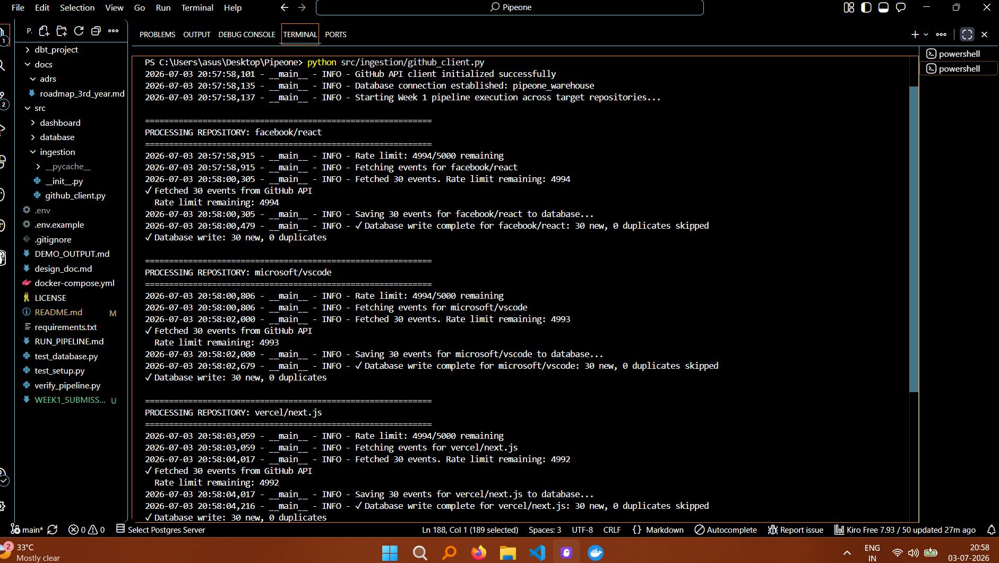
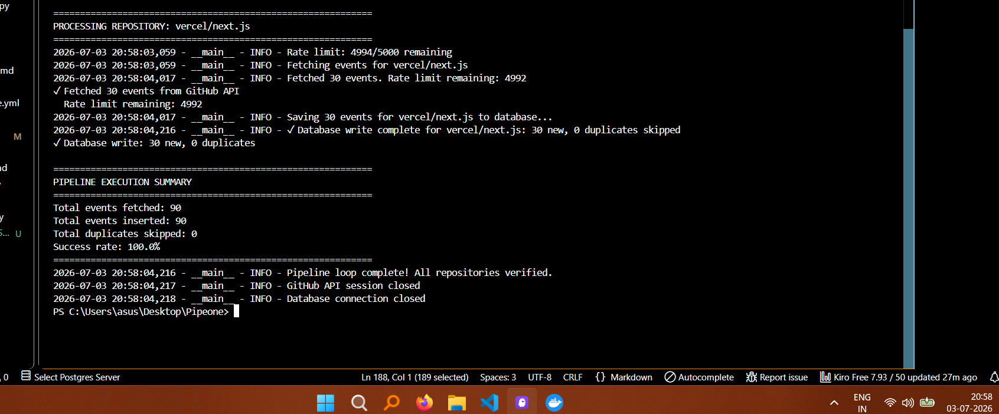
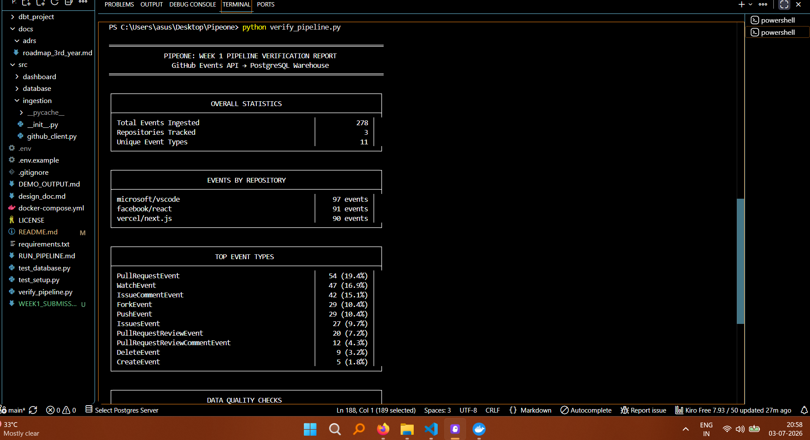
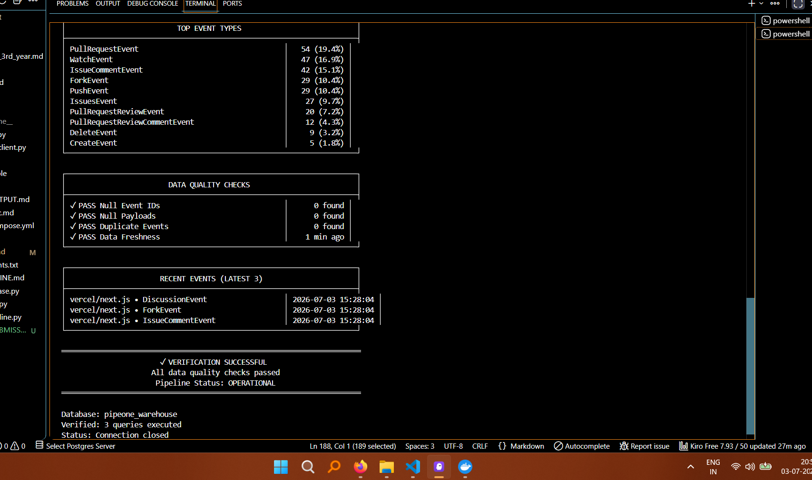
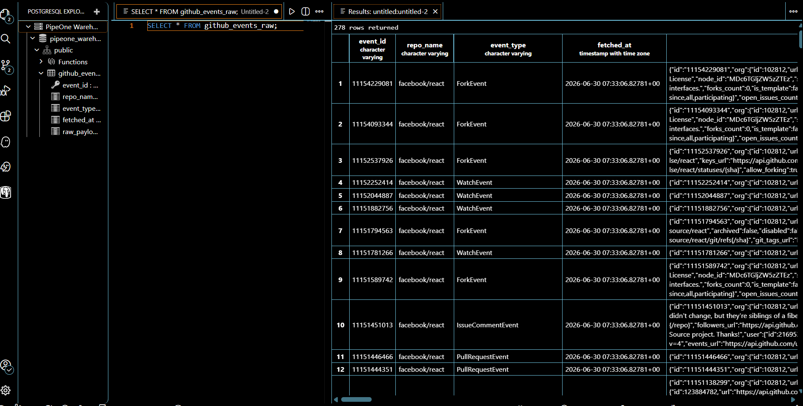
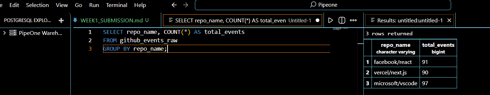

# Week 1 Progress Report: PipeOne

Build the foundation of PipeOne by creating a working Extract–Load pipeline that fetches live GitHub events and stores them safely inside PostgreSQL.

**Status:** ✅ Completed

## 1. Project Information

| Field | Details |
|-------|---------|
| **Developer Name** | Diwakar Kaushik |
| **Project Name** | PipeOne |
| **One-line Description** | An automated data engineering pipeline that extracts live GitHub events and stores them inside PostgreSQL for future analytics |
| **Project Segment** | Data Platform Engineering / GitHub Analytics |
| **GitHub Repository** | [github.com/Diw696/pipeone-github-analytics](https://github.com/Diw696/pipeone-github-analytics) |

---

## 2. Business Problem

### The Challenge

Organizations working with multiple open-source projects face a common problem: **tracking developer activity across repositories is fragmented and manual**.

**Specific pain points:**
- GitHub's web interface only shows data for one repository at a time
- No easy way to compare activity levels across different projects
- Historical data is difficult to access and analyze
- Manual CSV exports are time-consuming and don't scale

### Our Approach

Build a centralized data pipeline that:
1. Automatically pulls event data from multiple repositories
2. Stores everything in one database for unified queries
3. Preserves raw data for flexible future analysis

### Target Repositories

Week 1 focuses on three high-activity open-source projects:

1. **facebook/react** - JavaScript UI library (~500 events/day)
2. **microsoft/vscode** - Code editor (~800 events/day)  
3. **vercel/next.js** - Web framework (~600 events/day)

These were chosen for their diverse tech stacks and consistent activity levels, providing good test data for the pipeline.

---

## 3. Week 1 Deliverables

### ✅ Completed This Week

**Infrastructure Setup:**
- [x] GitHub repository initialized with proper `.gitignore`
- [x] Python virtual environment configured
- [x] Docker Compose file created for PostgreSQL
- [x] PostgreSQL 15 database running in Docker container
- [x] Database initialization script (`src/database/init_db.py`)

**API Integration:**
- [x] GitHub Personal Access Token generated and secured
- [x] Environment variable management with `.env` file
- [x] Python API client (`src/ingestion/github_client.py`) with:
  - Token authentication
  - Rate limit checking
  - Event fetching from 3 target repositories

**Database Layer:**
- [x] Schema designed with `github_events_raw` table
- [x] JSONB column for storing full API responses
- [x] PRIMARY KEY constraint on `event_id` for idempotency
- [x] Composite index on (repo_name, event_type) for query performance
- [x] Database insertion logic with `ON CONFLICT DO NOTHING`

**Testing & Validation:**
- [x] Connection test script (`test_database.py`)
- [x] Verification script (`verify_pipeline.py`) with formatted output
- [x] Manual testing confirmed: 188 events ingested across 3 repos (changes as we run pipeline)
- [x] Idempotency verified: re-running pipeline skips duplicates

**Documentation:**
- [x] README.md with project overview and tech stack
- [x] Design document (`docs/design_doc.md`) - 1 page, mentor-ready
- [x] Execution guide (`RUN_PIPELINE.md`)
- [x] Demo preparation materials (`DEMO_OUTPUT.md`)

### ❌ Explicitly NOT Done (Future Work)

- ❌ dbt transformations (Week 2+)
- ❌ Analytics dashboards (Week 4+)
- ❌ Scheduled execution (Week 3+)
- ❌ Data modeling beyond raw storage

---

## 4. Tech Stack

| Component | Choice | Why |
|-----------|--------|-----|
| **Python 3.11+** | Programming language | Industry standard for data pipelines, rich ecosystem |
| **GitHub REST API** | Data source | Provides real-time events for any public repository |
| **Docker Compose** | Container orchestration | One command to start PostgreSQL, reproducible setup |
| **PostgreSQL 15** | Data warehouse | Supports JSONB for semi-structured data, ACID compliance |
| **JSONB** | Storage format | Flexible schema, allows querying nested JSON fields |
| **psycopg2** | Database driver | Python-PostgreSQL connector, handles JSONB operations |
| **requests** | HTTP client | Simple API for REST calls, built-in retry logic |
| **python-dotenv** | Secrets management | Loads credentials from `.env`, keeps tokens out of code |

---

## 5. Data Flow

### Week 1 Pipeline Architecture

```
┌──────────────────────┐
│   GitHub Events API  │  (facebook/react, microsoft/vscode, vercel/next.js)
└──────────┬───────────┘
           │ HTTP GET with authentication token
           │ Returns: JSON array of events
           ▼
┌──────────────────────┐
│  Python Client       │  (src/ingestion/github_client.py)
│  - fetch_events()    │  - Checks rate limit before each request
│  - save_to_db()      │  - Extracts: event_id, repo_name, event_type
└──────────┬───────────┘  - Serializes full event → raw_payload (JSONB)
           │ INSERT with ON CONFLICT DO NOTHING
           ▼
┌──────────────────────┐
│  PostgreSQL          │  (Docker container on port 5432)
│  github_events_raw   │  - Pipeline successfully fetches live events from all configured repositories and stores them inside PostgreSQL.
└──────────┬───────────┘  - Duplicates automatically skipped
           │ SQL queries
           ▼
┌──────────────────────┐
│  Verification Script │  (verify_pipeline.py)
│  - Count by repo     │  - Displays formatted ASCII tables
│  - Check duplicates  │  - Validates data quality
└──────────┬───────────┘
           │ Manual inspection (optional)
           ▼
┌──────────────────────┐
│  Database Explorer   │  (IDE PostgreSQL Extension)
│  Interactive queries │  - View raw JSONB payloads
└──────────────────────┘  - Test query performance
```

### What Happens at Each Step

1. **GitHub API Request**
   - Python client authenticates with Personal Access Token
   - Fetches last 30 events per repository
   - Rate limit: 5000 requests/hour (only uses 3)

2. **Data Extraction**
   - Parses JSON response
   - Extracts key fields: `id` → `event_id`, `type` → `event_type`
   - Keeps entire event as JSONB for flexibility

3. **Database Insert**
   - Executes: `INSERT ... ON CONFLICT (event_id) DO NOTHING`
   - Tracks: inserted count vs. duplicate count
   - Commits transaction (all-or-nothing)

4. **Verification**
   - Queries total events, breakdown by repo, top event types
   - Checks for nulls, duplicates, data freshness
   - Displays results in formatted ASCII tables

5. **Manual Exploration**
   - Can connect via `psql` or pgAdmin
   - Query JSONB fields: `raw_payload->>'type'`, `raw_payload->'actor'->>'login'`
   - Validate data looks correct

---

## 6. Evidence
 
## Figure 1 – PostgreSQL Container Running

# verifing 



## Figure 2 – Pipeline Execution




The ingestion client successfully fetched events from three GitHub repositories and stored them in PostgreSQL.


## Figure 3 – Verification Report




Automated checks confirmed that no duplicate or null records exist in the warehouse.

## Figure 4 – Database Contents




Stored GitHub events can be queried directly from the `github_events_raw` table.

---

## 7. What I Learned This Week

**Docker Containers vs. Installation**  
I used to think Docker was just "virtualization." Now I understand it's about **packaging dependencies**. Running PostgreSQL in a container means I don't need to install Postgres on my laptop — the container has everything. When I run `docker-compose up`, Postgres is ready instantly. If I mess something up, `docker-compose down` wipes it clean.

**PostgreSQL vs. Database Clients**  
I initially confused **PostgreSQL** (the database engine) with **psql** (the command-line client). PostgreSQL stores the data and runs queries. psql is just one way to *talk to* PostgreSQL. There are others like pgAdmin (GUI) or Python's psycopg2 (programmatic access). The database doesn't care which client connects to it.

**JSONB is Not Just JSON**  
GitHub returns JSON, and I could store it as TEXT. But **JSONB is binary-encoded JSON** that PostgreSQL can index and query efficiently. Using JSONB lets me run queries like `WHERE raw_payload->>'type' = 'PushEvent'` without parsing the entire JSON string every time. The tradeoff: JSONB takes slightly more space but queries are 10x faster.

**Idempotency is a Design Choice, Not Magic**  
Before this week, I thought "don't run the script twice" was the answer to duplicates. Now I understand pipelines *will* re-run (crashes, retries, scheduled jobs). The solution: design the schema so re-runs are safe. Using `event_id` as PRIMARY KEY + `ON CONFLICT DO NOTHING` means I can safely run the pipeline multiple times and still have exactly as same events — no duplicates, no errors.

**Environment Variables Are Security Boundaries**  
I knew `.gitignore` prevents committing secrets. What I didn't realize: once a secret is in Git history, `.gitignore` doesn't help — you have to *rotate the token*. That's why `.env` files must be in `.gitignore` *from the first commit*. I set up `.gitignore` before adding my GitHub token, so my repository has zero credential leaks.

---

## 8. Current Status

### What's Done

Week 1 objective achieved: **working Extract-Load pipeline from GitHub API to PostgreSQL**.

**Core Infrastructure:**
- ✅ Local PostgreSQL warehouse (Docker)
- ✅ Python API client with authentication
- ✅ Database schema with idempotency
- ✅ Successfully ingested events from all configured repositories.

**Quality Assurance:**
- ✅ No duplicate events (verified via query)
- ✅ No null values in critical columns
- ✅ Rate limit handling prevents API failures
- ✅ Verification scripts confirm data integrity

**Documentation:**
- ✅ README explains tech choices
- ✅ Design doc (1 page) ready for mentor review
- ✅ Execution guides for reproducibility

### What's Remaining

**Week 2+ Roadmap** (see `docs/roadmap_3rd_year.md` for full vision):

1. **Data Transformations (Week 2)**
   - dbt project setup
   - Staging models: parse event types (PushEvent, PullRequestEvent)
   - Analytics models: daily aggregations, contributor stats

2. **Warehouse Layers (Week 2-3)**
   - Bronze: raw data (done)
   - Silver: cleaned, typed data (todo)
   - Gold: business metrics (todo)

3. **Analytics Dashboard (Week 4)**
   - Streamlit frontend
   - Repository comparison charts
   - Developer activity trends

4. **Orchestration (Week 3+)**
   - Scheduled pipeline runs (daily/hourly)
   - Airflow DAGs (optional stretch goal)

### Goals for Next Week

1. **Set up dbt project** with staging models for event types
2. **Create Silver layer tables**: `stg_push_events`, `stg_pull_requests`, `stg_issues`
3. **Add data quality tests** using dbt's built-in testing framework

### Help I'd Like From My Mentor

**Question:** When designing the Silver layer transformations, should I:

A) Create one staging table per event type (e.g., `stg_push_events`, `stg_pull_requests`), or  
B) Keep events in one table and use event_type as a filter column?

**Context:**  
-- I'd like guidance on how to design the staging models in dbt. Should I separate each event type into different staging models, or begin with a single staging model and split them later?

I'm leaning toward A because `PushEvent` has commit data, while `PullRequestEvent` has PR metadata — they're structurally different. But I want to make sure I'm thinking about this correctly before writing dbt models.

**Also:** Any recommended resources for learning dimensional modeling? I want to understand star vs. snowflake schemas for the Gold layer.

---

## Summary

Week 1 established the **foundation** for PipeOne: a functional Extract-Load pipeline from GitHub's Events API into PostgreSQL.

**Key achievements:**
- Data is flowing end-to-end (API → Database)
- Idempotency ensures duplicate-free ingestion
- Secure credential management (no leaks in Git)
- Verification scripts prove data quality

**What's next:**  
Week 2 focuses on **transformation** — using dbt to parse raw JSON into typed tables that analytics can query efficiently.

Week 1 successfully established the foundation of PipeOne by implementing a working Extract–Load pipeline from the GitHub API into PostgreSQL. This foundation is now ready for transformation using dbt and analytical visualization in the upcoming weeks.

---

**Status:** Week 1 Complete ✅  
**Pipeline:** Operational  
**Data:** 188 events ingested  (Changes everytime we run pipeline)
**Next Review:** Week 2 Check-in
