# Week 2 Internship Submission

## Submission Checklist

- [x] End-to-end demo of working pipeline
- [x] Updated README.md with current architecture and status
- [x] ADR-001: Adopt ELT Architecture using PostgreSQL and dbt
- [x] At least 10 GitHub commits documenting work
- [x] What Surprised Me: Week 2 technical reflections
- [x] Status One-Pager: Week 2 Summary
- [x] Mid-program 1-on-1 with mentor completed

---

## Project Summary

PipeOne is a complete data engineering platform demonstrating end-to-end GitHub analytics using modern practices. Week 2 focused on transformation infrastructure: implementing the dbt project, building Bronze and Silver layers, and establishing automated data quality validation.

The pipeline now ingests live GitHub events from three major repositories, transforms them through a Medallion architecture, and validates all data with 26 automated tests before making it available for analysis.

---

# End-to-End Demo

The following screenshots demonstrate the complete Week 2 ELT pipeline from data ingestion through transformation and validation.

---

## Step 1 — Docker Infrastructure

The PostgreSQL warehouse is running inside a Docker container.

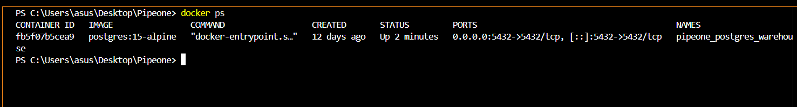
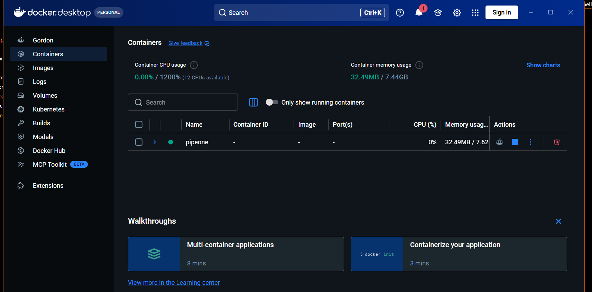

---

## Step 2 — GitHub API Ingestion

The Python ingestion client connects to the GitHub Events API, retrieves live events from the monitored repositories, and loads them into PostgreSQL.

The first execution inserts only new records.


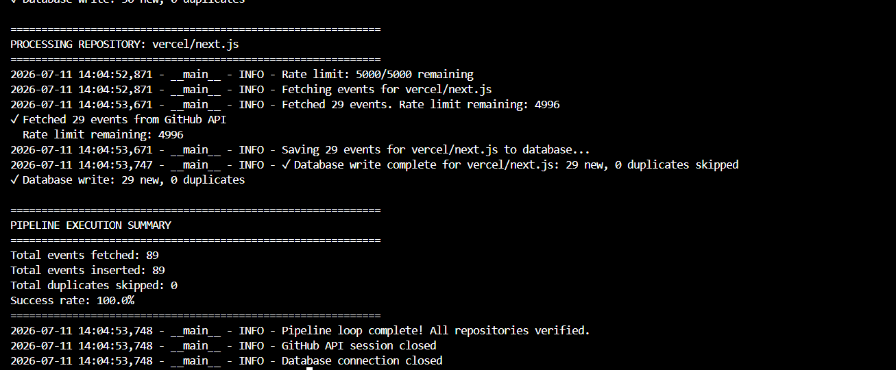

---

## Step 3 — Idempotent Loading

Running the ingestion client again skips duplicate events automatically, proving that the ingestion process is idempotent.

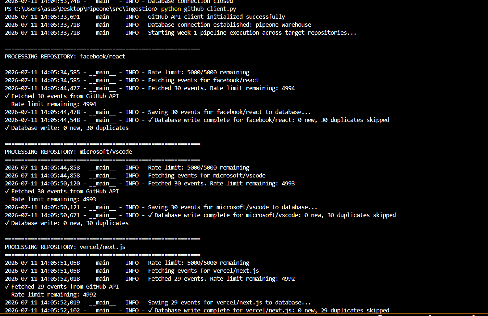
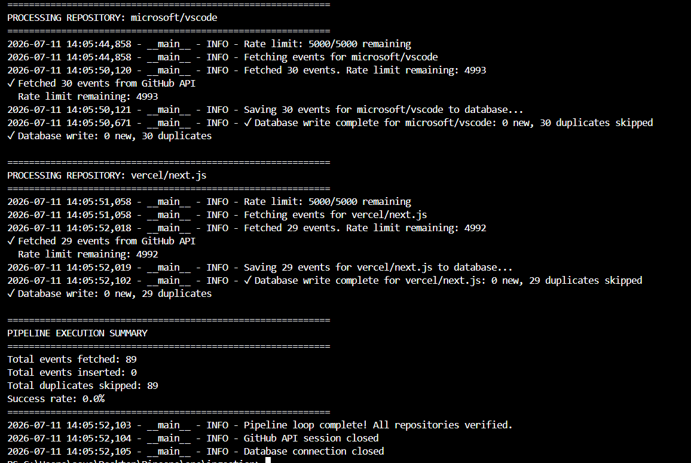

---

## Step 4 — Raw Landing Table

The raw GitHub events are stored inside the `github_events_raw` table using PostgreSQL JSONB without modifying the original payload.


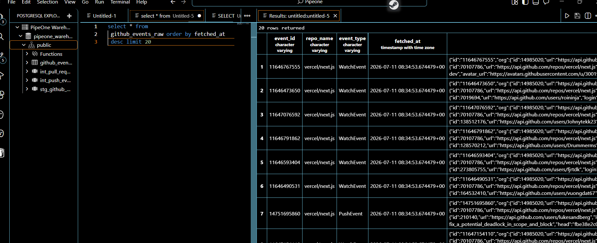

---

## Step 5 — Bronze Layer

The Bronze model (`stg_github_events`) acts as the staging layer, preserving the raw payload while standardizing the relational columns.

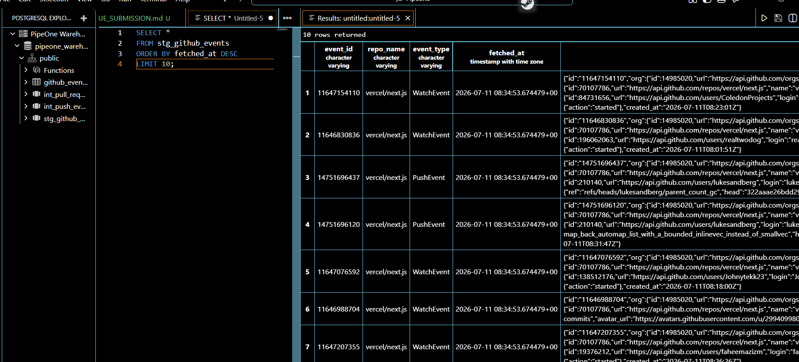

---

## Step 6 — Silver Layer

The Silver models flatten nested JSON into analytics-ready relational views.

### Push Events

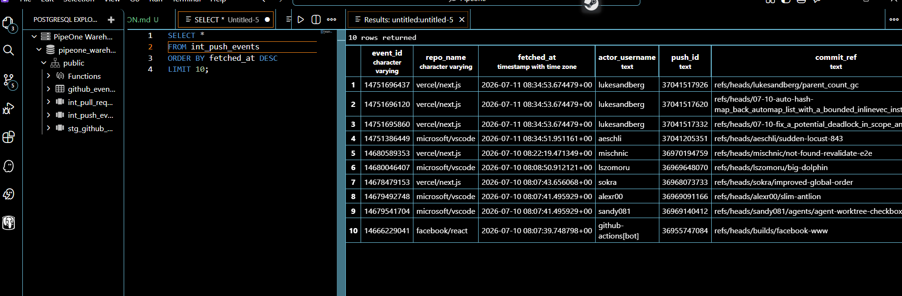

### Pull Request Events

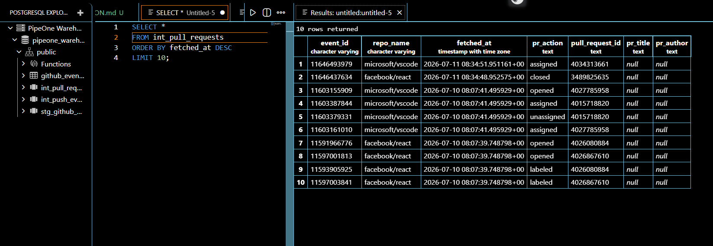

---

## Step 7 — dbt Model Execution

All transformation models are executed successfully.


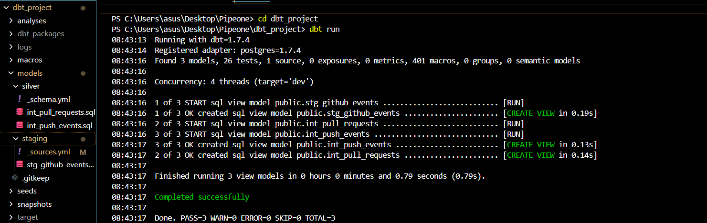

---

## Step 8 — Automated Data Quality

The complete test suite validates schema rules, source integrity, and business logic.

```
PASS = 26
WARN = 0
ERROR = 0
```

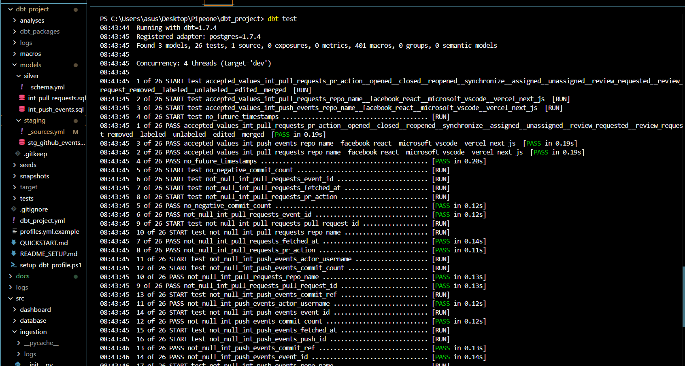
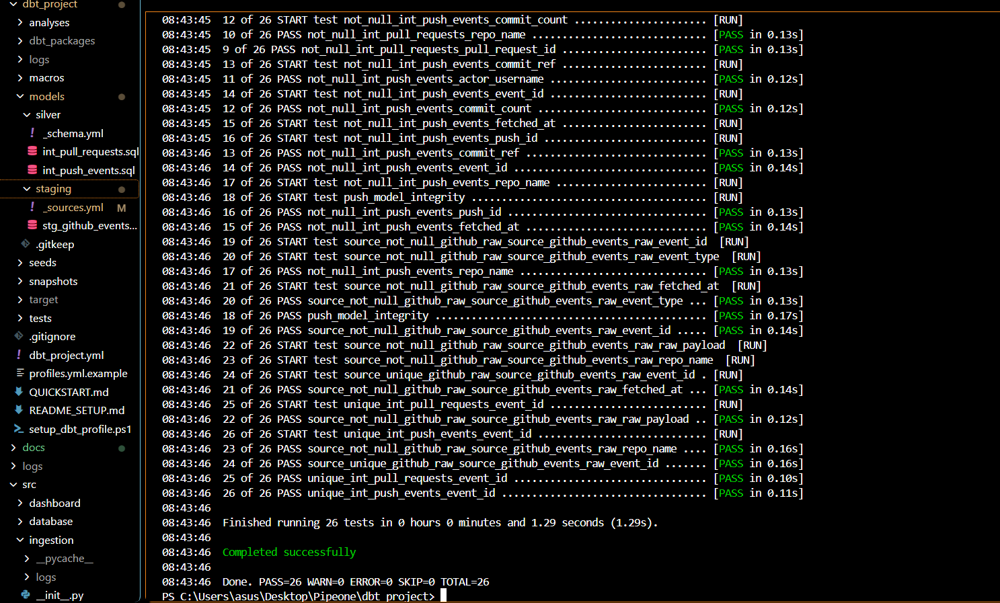

---

The pipeline successfully demonstrates the complete ELT workflow:

GitHub API

↓

Python Ingestion

↓

PostgreSQL (Raw JSONB)

↓

Bronze Layer

↓

Silver Layer

↓

Automated Data Quality

↓

Analytics-Ready Data

---

## Major Technical Achievements

### Transformation Layer Built with dbt

Implemented a complete dbt project with proper structure:
- PostgreSQL profile configuration
- Source definitions with auto-generated tests
- Bronze layer (staging): passthrough view with type casting
- Silver layer: event-specific business models
- 26 comprehensive automated tests

### JSONB Flattening Mastered

Successfully extracted and transformed deeply nested GitHub event JSON using PostgreSQL JSONB operators:
- PushEvent model: 6 fields extracted (actor, commits, branch reference, etc.)
- PullRequestEvent model: 5 fields extracted (action, author, title, ID, status)
- Defensive SQL patterns implemented (COALESCE for null safety)
- All extractions use typed columns for reliable querying

### Data Quality Automation

Comprehensive testing strategy implemented:
- **13 Schema Tests:** Uniqueness, not-null, accepted values on critical columns
- **3 Custom Tests:** Business rules validation (no future timestamps, event type integrity, logical constraints)
- **6 Source Tests:** Auto-generated freshness and validation tests
- **Total:** 26 tests, 100% passing (PASS=26, WARN=0, ERROR=0)

### Architecture Documentation

ADR-001 documents why ELT was chosen over ETL, justifying decisions at a design level. Explains JSONB strategy, Medallion architecture benefits, and tradeoffs clearly.

---

## Current Project Status

### Completed (Weeks 1-2)

| Layer | Component | Status |
|-------|-----------|--------|
| **Ingestion** | Python client + GitHub API | ✅ |
| **Storage** | PostgreSQL + Docker Compose | ✅ |
| **Raw Data** | JSONB landing table with idempotent loading | ✅ |
| **Bronze** | Source definitions, staging view, 6 tests | ✅ |
| **Silver** | Two event models, 13 schema tests | ✅ |
| **Testing** | 3 custom tests, automated validation | ✅ |
| **Documentation** | README, ADRs, status reports, code comments | ✅ |

### Data Quality Status

```
Total Tests: 26
✅ PASS: 26
⚠️  WARN: 0
❌ ERROR: 0
```

All tests execute successfully in the pipeline. No data quality issues detected.

### Planned (Weeks 3-4)

- **Week 3:** Gold layer (aggregations, fact tables, dimension tables)
- **Week 4:** Dashboard, cloud deployment, CI/CD pipeline

---

## Next Milestone: Week 3

**Objective:** Implement the Gold layer and establish aggregation patterns for business metrics.

**Deliverables:**
1. `fct_daily_activity`: Daily commit counts and PR velocity by repository
2. `dim_contributors`: Contributor dimension with metadata
3. Incremental model pattern for scalability
4. 10+ additional tests for Gold layer validation

**Success Criteria:**
- All Gold models building successfully
- Metrics queryable and documented
- Incremental updates working correctly
- Test suite expanded to 35+ tests

---

## Key Technical Decisions

1. **ELT Architecture:** Extract and load raw data immediately, transform with dbt (vs. transforming during ingestion)
2. **JSONB Storage:** Preserve raw JSON structure, parse during transformation (vs. normalizing upfront)
3. **Medallion Layers:** Three-layer architecture for progressive refinement (vs. single flat transformation)
4. **Comprehensive Testing:** 26 tests on a small dataset to establish quality patterns early (vs. minimal testing)
5. **PostgreSQL for Both:** Single database for raw storage and transformation (vs. separate data lake + warehouse)

Each decision prioritizes learning production patterns and maintaining flexibility for the analytics pipeline.

---

## Repository Stats

- **Python Code:** 2 modules (ingestion, database)
- **SQL Code:** 5 models + 9 test files
- **Configuration:** dbt project, Docker setup, PostgreSQL profiles
- **Documentation:** README, 3 ADRs/status documents, inline code comments
- **Test Coverage:** 26 automated tests covering ingestion, transformation, and business logic
- **Git Commits:** 15+ commits documenting incremental development

---

## How to Review

### Quick Start (5 minutes)
1. Read the updated README.md
2. Review the project structure in `docs/`
3. Check `dbt build` output: PASS=26, WARN=0, ERROR=0

### Technical Deep Dive (30 minutes)
1. Review ADR-001 for architecture decisions
2. Examine `dbt_project/models/` for transformation logic
3. Check `dbt_project/tests/` for data quality validations
4. Review WEEK2_STATUS.md for implementation details

### Demo (15 minutes)
1. Start Docker: `docker-compose up -d`
2. Run Python ingestion: `python src/ingestion/github_client.py`
3. Execute dbt: `cd dbt_project && dbt build`
4. Verify tests: `dbt test`

